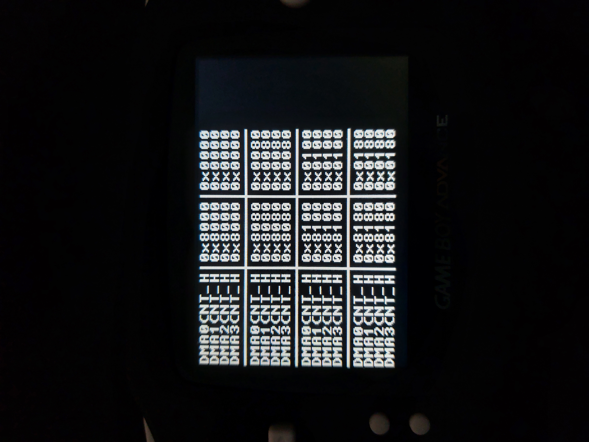
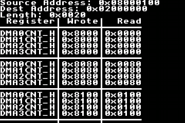
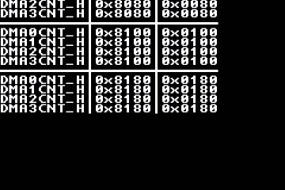

# DMACNT test
Prints the value of DMAxCNT_H after starting a DMA from ROM with different source address settings.
Decrement and Fixed modes are not valid in this situation (except for channel 0, which only has 27 bits in DMA0SAD and reads from BIOS) and the DMA works as if they were Increment. Despite this, the corresponding bits are not reset and should remain the same when read afterward.

Expected result (gathered from a GBA. Credit to Chickensalad https://discord.com/channels/465585922579103744/465586361731121162/928307262508904498):

Expected result (gathered from a 3DS):

